# riyadh-estate

This is a beautiful real estate applicaion in reactJs

* Home oage

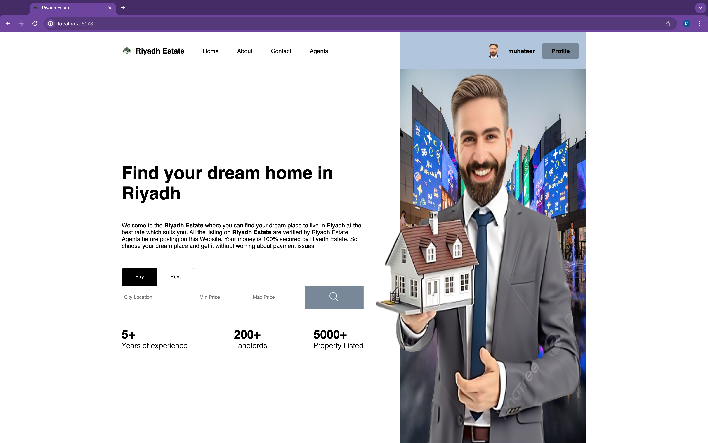

* List Page

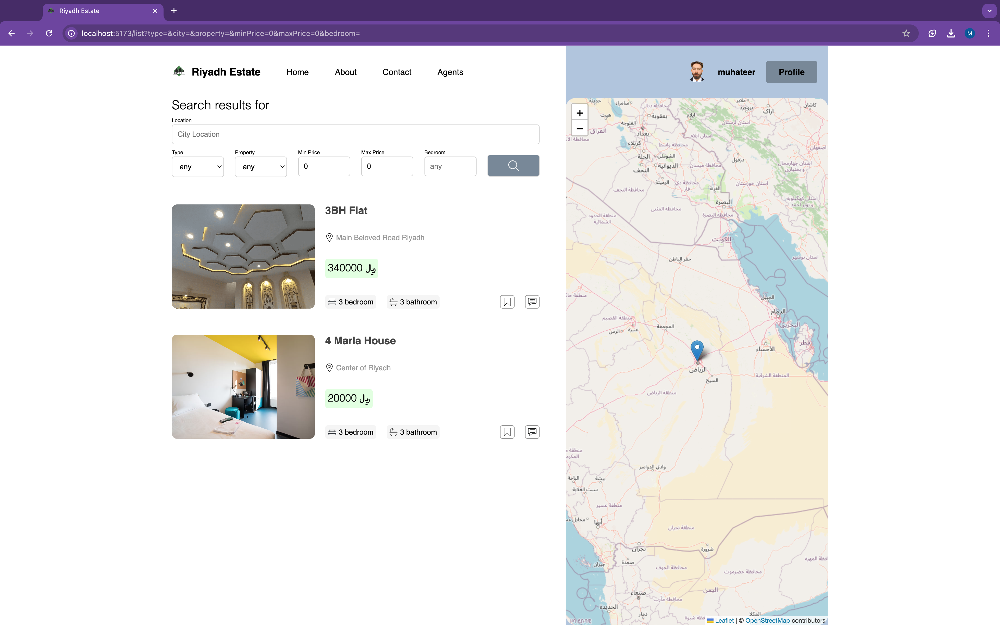

* Property Page Full details

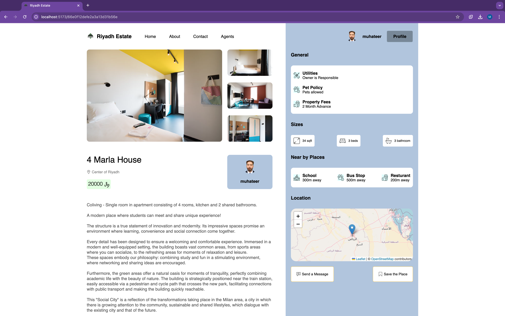

* Save Button which save the property to the user profile save list

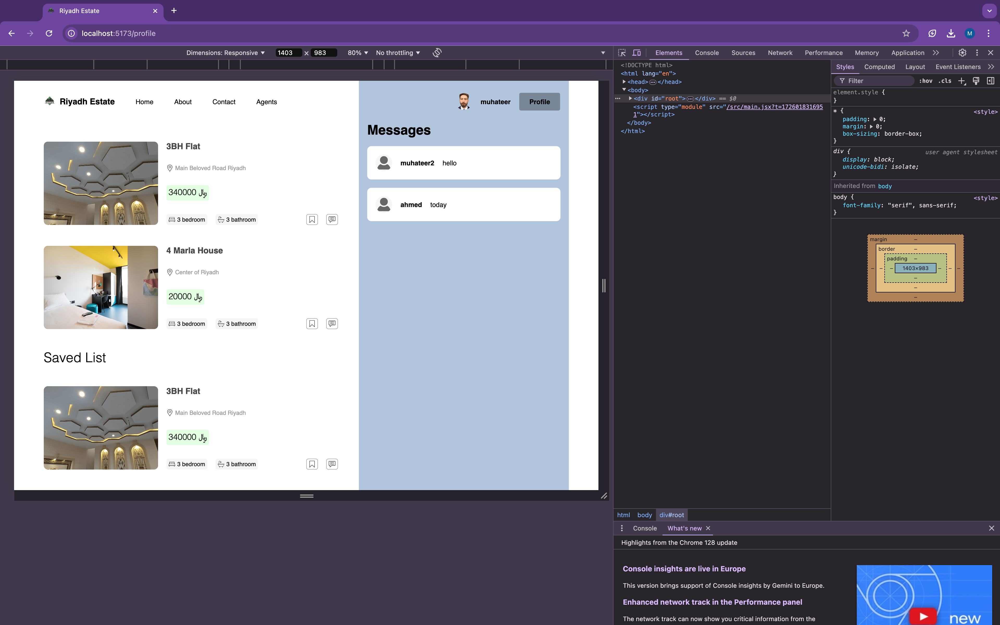

* Full Page Gallery Photo View

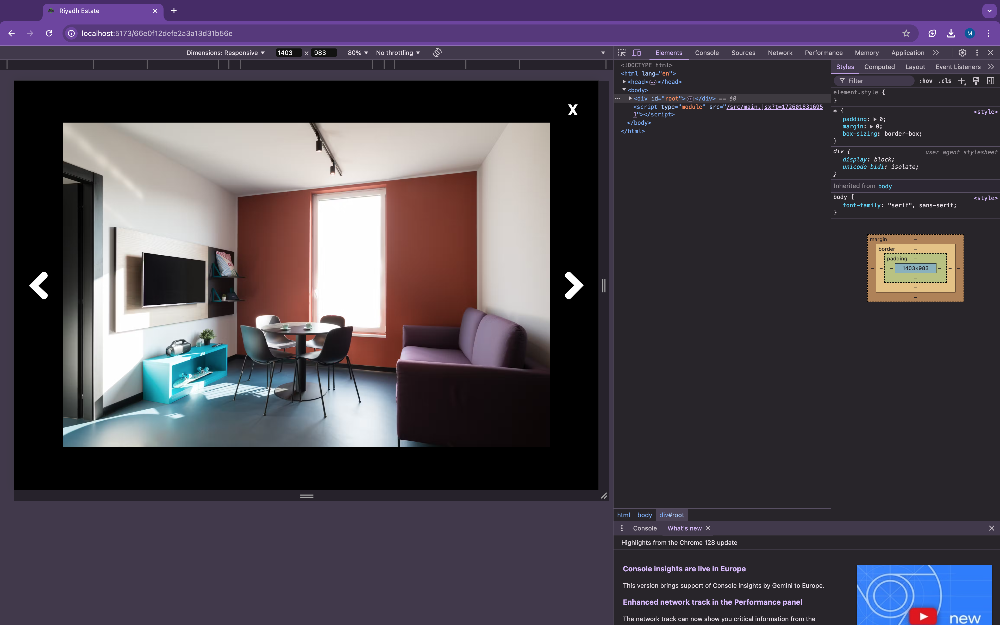

* Mobile Reponsive Pages

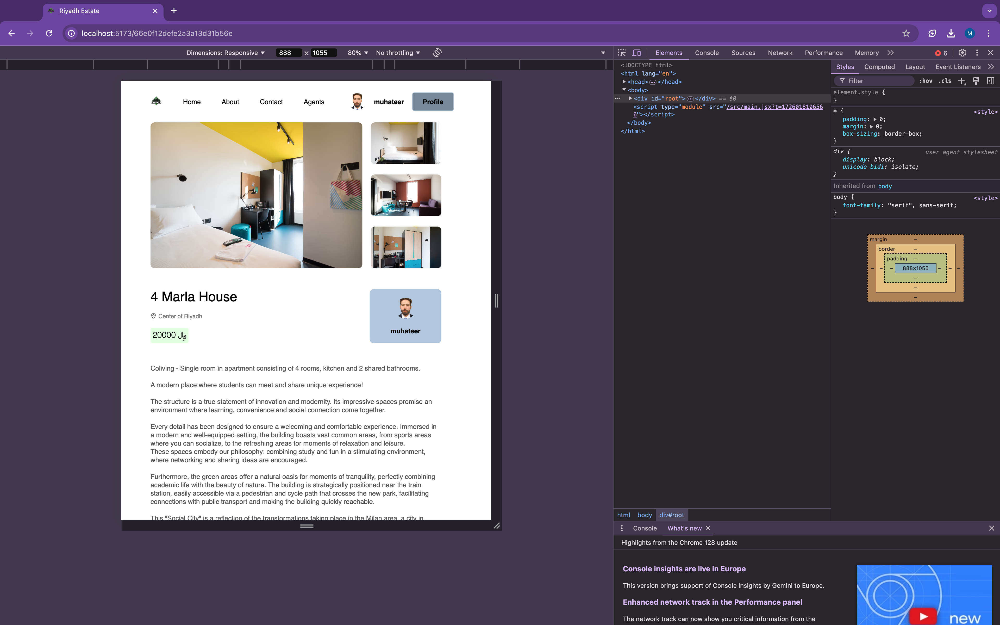

* Live Chat between tenant , buyer , seller

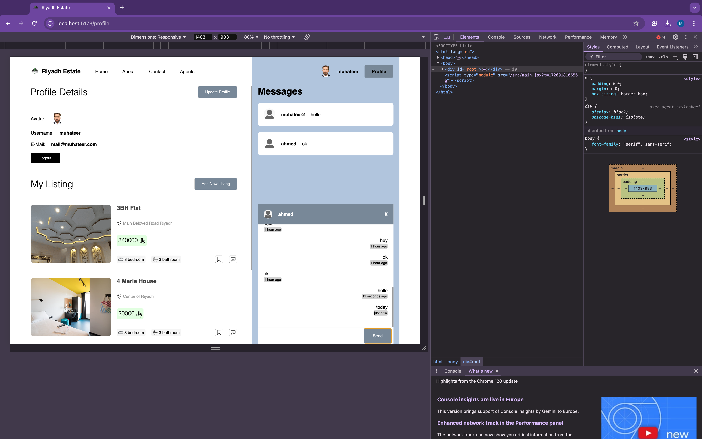

* Add new property for buy/sell/rent options available

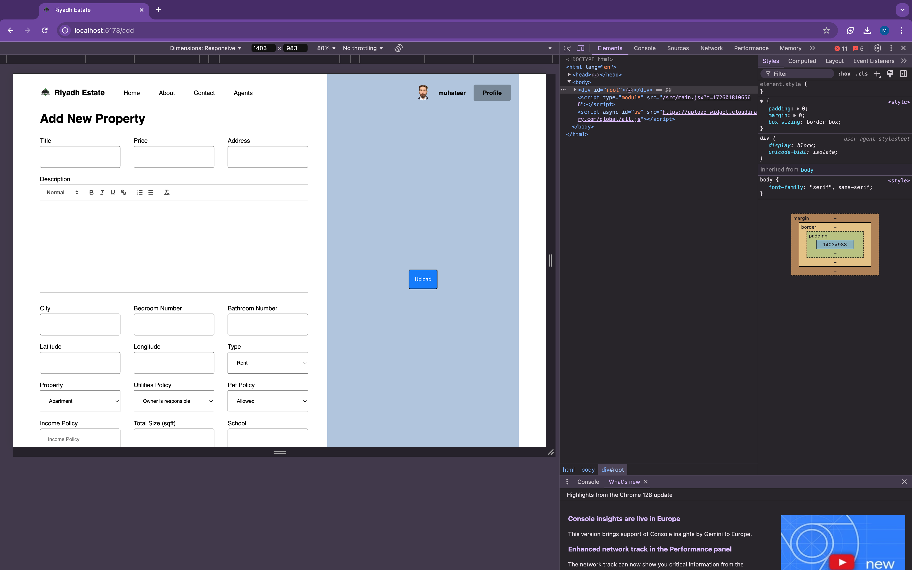

* Guest Viewer Page with onHover Effects

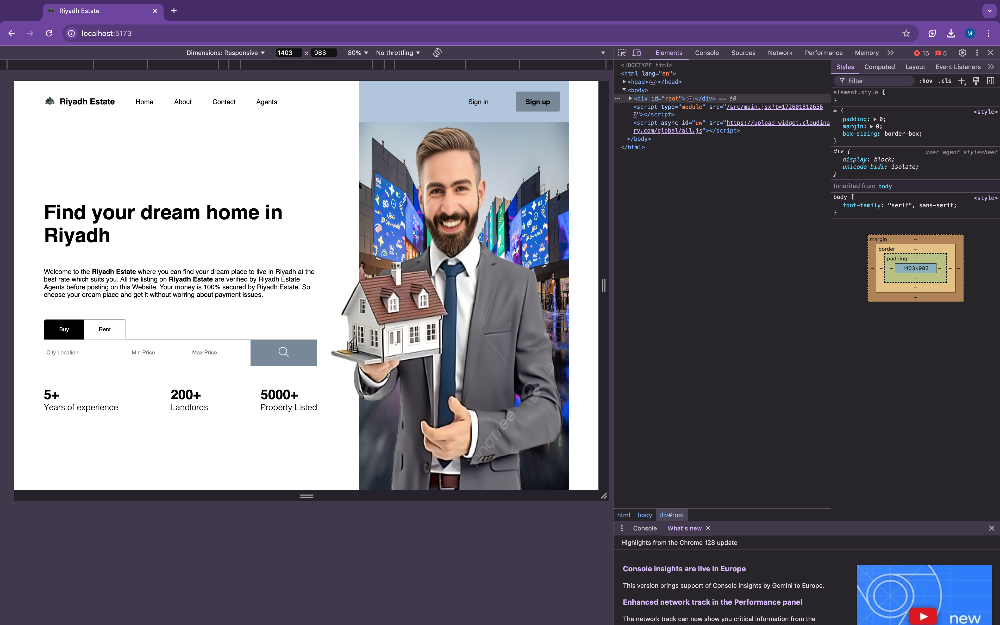

* SignUp Page using TokenID and MongoDb database

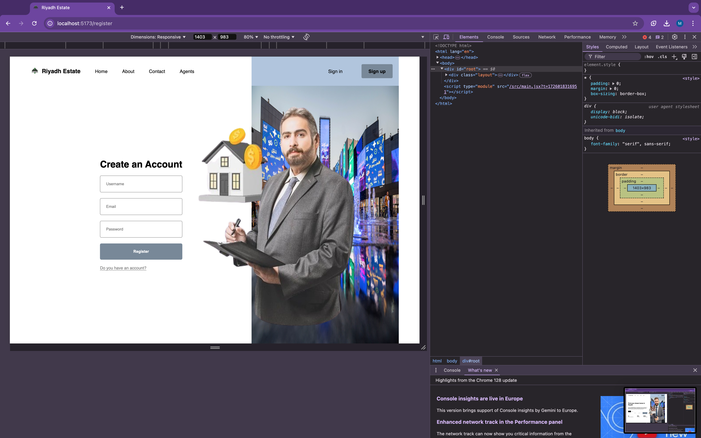

* Stunning beautifull Riyadh Login Page using AuthContext - TokenId , MongoDb

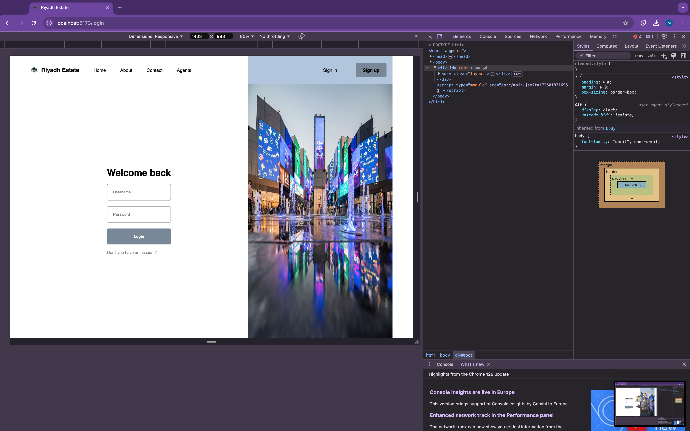

> if you want to hire me for your final year project or if you have a custom project which you want to accompalish or you have a project which has so many bugs than you can contact me on my email , given in my porfolio.
